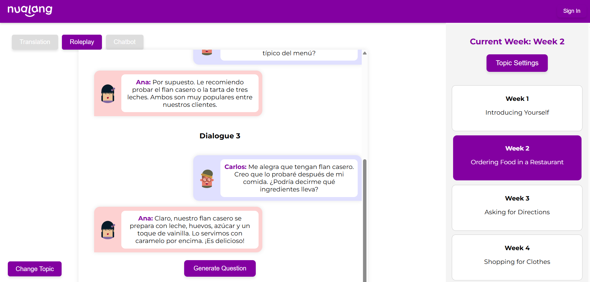

# AI Course Designer

An AI-powered web application that generates personalized language learning journeys by combining React, Node.js, and AWS Lambda. The platform adapts to each learner's style and goals, providing interactive, AI-driven learning experiences.

---

## Live Demo & Video
- Live Demo: [http://group7reactdemo.s3-website-eu-west-1.amazonaws.com/](http://group7reactdemo.s3-website-eu-west-1.amazonaws.com/)  
- Demo Video: [Watch on Google Drive](https://drive.google.com/file/d/1NEHvgArzDEscEg_cQBMgbmM5ldTAntgD/view?usp=sharing)

---

## Preview

*AI Course Designer deployed on AWS S3 + Lambda with adaptive learning features*

---

## Features
- AI-generated **flash cards** to reinforce memory with active recall and spaced repetition  
- **Chatbot interaction** for defining learning goals and personalized progress feedback  
- **Roleplay conversations** simulating real-life scenarios for contextual understanding  
- Automatic **question generation** based on dialogues or input content  
- **Course outline suggestions** tailored to each learner's goals and style  
- **Adaptive weekly planning** that adjusts course duration and workload dynamically  

---

## Tech Stack
**Frontend:**  
- React (Vite, Hooks)  
- Material-UI for UI design  
- Axios for API communication  

**Backend:**  
- Node.js (Express-style app)  
- AWS Lambda for serverless execution  
- AWS API Gateway for routing  

**Database & Cloud:**  
- AWS DynamoDB for persistent data storage  
- AWS S3 for static hosting  
- AWS IAM for permissions and deployment  

**AI Integration:**  
- OpenAI GPT models for chatbot, flashcards, roleplay, and content generation  

**Deployment:**  
- AWS S3 + CloudFront (frontend hosting)  
- AWS Lambda + API Gateway (backend)  
- GitHub for version control and collaboration  

---

## Project Structure
```
ai-course-designer/
├── frontend/                # React Frontend
│   ├── src/                 # Components & Pages
│   ├── public/              # Static assets
│   ├── package.json         # Frontend dependencies
│   └── vite.config.js       # Vite configuration
├── backend/                 # Serverless Backend
│   ├── src/                 # Lambda functions
│   ├── app.mjs              # Main backend entry
│   └── package.json         # Backend dependencies
├── screenshots/             # Screenshots for README
├── .gitignore
├── LICENSE
└── README.md
```

---

## Getting Started (Local Setup)
```bash
# 1. Clone the repository
git clone https://github.com/SeanXC/sweng25_group07-aicoursedesigner.git
cd sweng25_group07-aicoursedesigner
```

### Frontend Setup
```bash
cd frontend
npm install
npm run start
# App will run at http://localhost:3000/
```

### Backend Setup
```bash
cd backend/src
npm install
node app.mjs
# Lambda-like backend will run locally
```

---

## Contributions
This project demonstrates the following skills:

- **Serverless backend development** with AWS Lambda + API Gateway
- **Modern frontend development** with React (Vite, Hooks, Material-UI)
- **AI integration** with OpenAI GPT models for flashcards, roleplay, and chatbot features
- **Cloud-native data handling** with AWS DynamoDB + S3 hosting
- **Agile teamwork**: coordinated 8-person Scrum team using sprints, stand-ups, and retrospectives

---

## License
MIT License – feel free to use and modify for learning purposes.